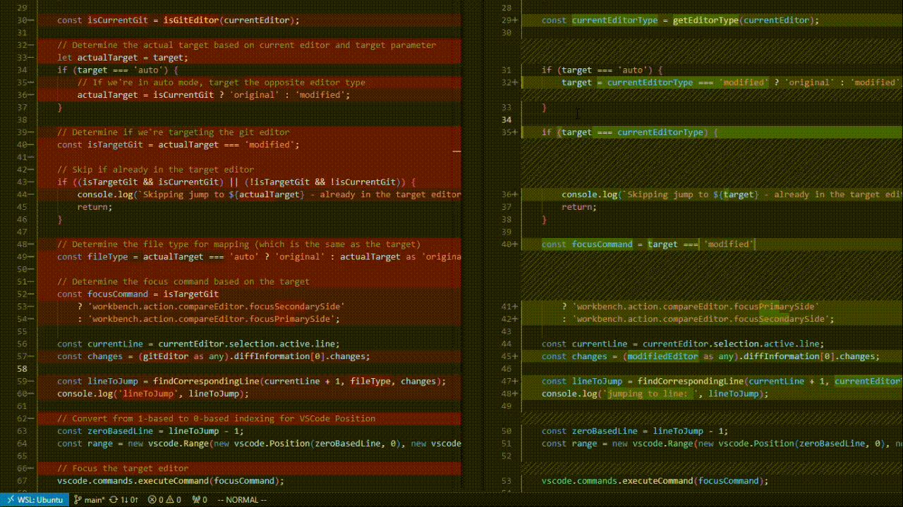

# Compare Editor Jump



This extension enhances the VSCode diff view by allowing you to jump between the original and modified files while maintaining visual alignment. Unlike the built-in commands (`workbench.action.compareEditor.focusSecondarySide` and `workbench.action.compareEditor.focusPrimarySide`), this extension automatically adjusts the cursor position to ensure you stay on the same logical line when switching between editors.

## Features

- **Jump to Original**: Jump from the modified editor to the original editor while maintaining visual alignment
- **Jump to Modified**: Jump from the original editor to the modified editor while maintaining visual alignment
- **Jump to Other Editor**: Automatically detect which editor you're in and jump to the other one while maintaining visual alignment
- **Open diff on current line**: Opens the diff and jumps to the line which which the opening was triggered from

The extension intelligently handles line number differences caused by additions, deletions, and modifications in the diff view, ensuring that you always land on the corresponding line in the target editor.

## Usage

When you have a diff view open (for example, when viewing changes in the source control panel), you can use the following commands:

- `Diff Jumper: Jump to Original` - Jump to the original editor
- `Diff Jumper: Jump to Modified` - Jump to the modified editor
- `Diff Jumper: Jump to Other Editor` - Jump to whichever editor you're not currently in

If you want to open a diff (`git.openChange`) and you want to end up on the same line you triggered the opening open use this command:
- `Diff Jumper: Open Diff on Current Line` 


You can access these commands through the Command Palette (Ctrl+Shift+P or Cmd+Shift+P) or by assigning keyboard shortcuts.

## Recommended Keyboard Shortcuts

For the best experience, we recommend adding the following keyboard shortcuts to your `keybindings.json` file:

```json
[
  {
    "key": "alt+left",
    "command": "diffJumper.jumpToOriginal",
    "when": "textCompareEditorVisible"
  },
  {
    "key": "alt+right",
    "command": "diffJumper.jumpToModified",
    "when": "textCompareEditorVisible"
  },
  {
    "key": "alt+space",
    "command": "diffJumper.jumpToOther",
    "when": "textCompareEditorVisible"
  }
]
```

With these shortcuts, you can use:
- `Alt+Left` to jump to the original editor
- `Alt+Right` to jump to the modified editor
- `Alt+Space` to toggle between editors

## How It Works

The extension analyzes the diff information between the original and modified files to create a mapping between line numbers. When you jump between editors, it:

1. Determines your current position
2. Finds the corresponding line in the target editor
3. Adjusts for additions, deletions, and modifications
4. Positions the cursor at the correct line in the target editor

This ensures that you stay on the same logical line, even when the line numbers differ due to code changes.

---

**Enjoy!**
